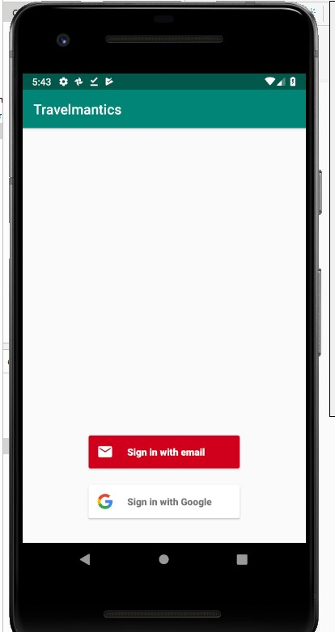
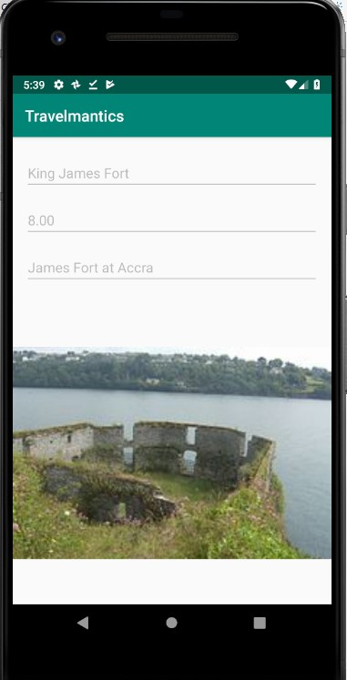

# TRAVELMANTICS
ALC4.0 challenge 2: This challenge is an Android Application called Travelmantics. It will help user find holiday deals. To complete this challenge, you are expected to complete this course

## Interface
#+html: 

|
#+html: 

|
#+html: 

|
---
#+html: 

|
#+html: 

|
#+html: 

|
---
#+html: 

|
#+html: 

|
#+html: 

